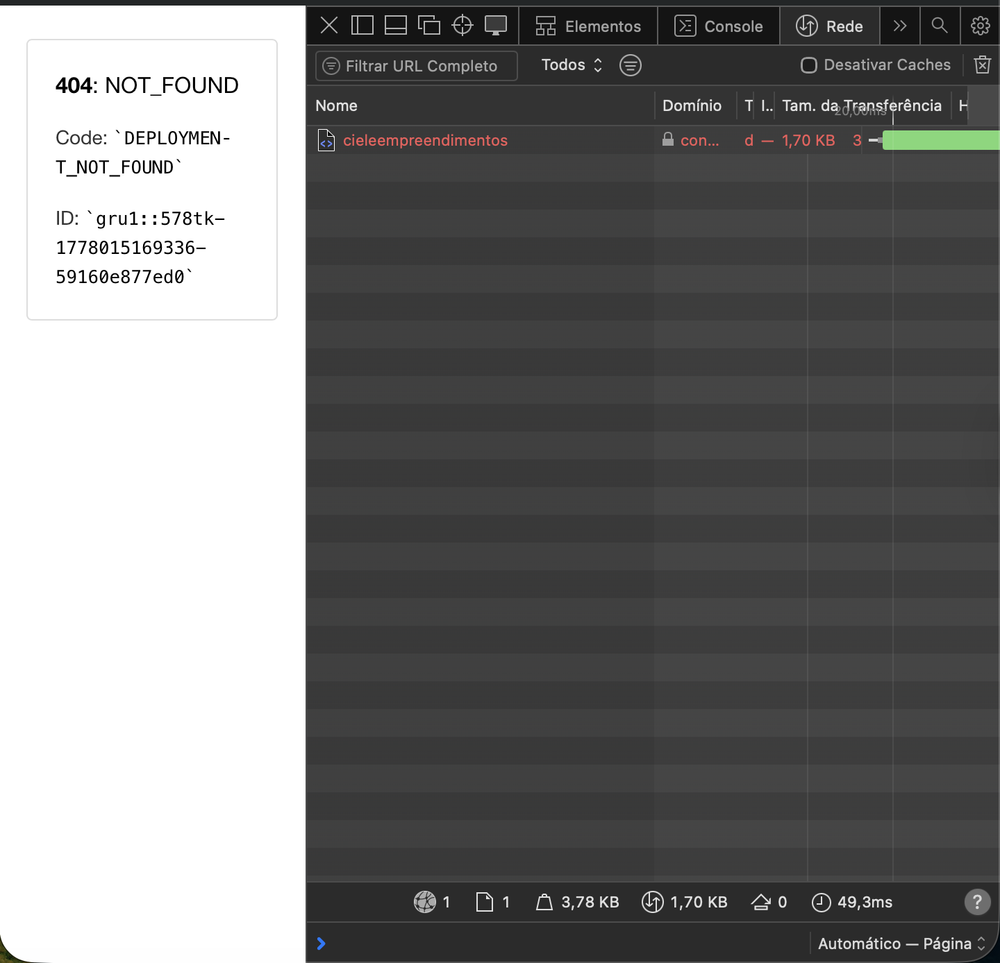
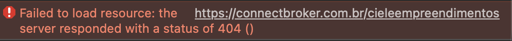

# Bug Report: Erro 404 na Home Page

**ID:** BUG-001
**Título:** [Home] Erro 404 ao acessar a URL principal do site.
**Severidade:** Crítica (Bloqueante)
**Prioridade:** Alta

### Ambiente

- **Navegadores:** Safari e Google Chrome (v124)
- **URL:** [https://www.cieleempreendimentos.com.br](https://www.cieleempreendimentos.com.br)

### Descrição

Ao acessar o domínio principal, o servidor retorna uma página de erro 404 (NOT_FOUND), impedindo o acesso a qualquer conteúdo do site.

## Passos para Reproduzir

1. Abrir o navegador;
2. Digital a URL: `www.cieleempreendimentos.com.br` na barra de endereços;
3. Pressione "Enter";

### Resultados

- **Resultado Atual**: A tela exibe a mensagem "404: NOT_FOUND".
- **Resultado Esperado:** O site deve carregar a página inicial com sucesso (Status 200)

## Evidências

- ## Notas Técnicas
- O erro foi reproduzido em múltiplos navegadores, confirmando falha no recurso hospedado em `connectbroker.com.br`.

## 🏁 Encerramento e Ações Realizadas

## 📬 Comunicação com Stakeholders

- **Ação:** Notificação técnica enviada ao proprietário do estabelecimento via [Canal de Comunicação, ex: WhatsApp/E-mail] no dia 05/05/2026.
- **Objetivo:** Informar sobre a falha crítica de "Deployment Not Found" (Erro 404) identificado através do console de desenvolvimento, visando reduzir o tempo de inatividade do site e a perda de clientes.

## 🔄 Status do Reteste

- [ ] **Aguardando Correção:** O site ainda apresenta o erro original.
- [ ] **Validado:** (Preencher quando o site voltar ao ar e testar novamente).
